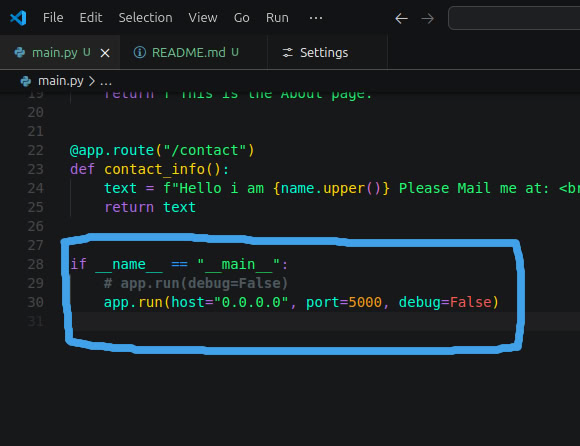
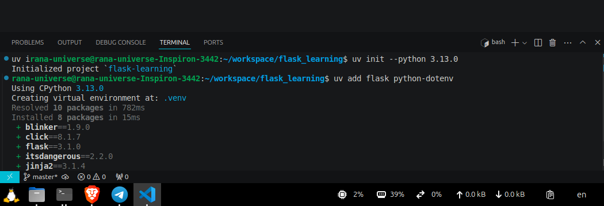

# Information About This Flask

`uv sync` - I will run this after clone this repo.

[My Learning Progression](/docs/todo.md)

Important Part Below Image 👇👇👇

This is the main part which allow to see the page in my mobile in same network.

This is i am learning flask from beginning,

